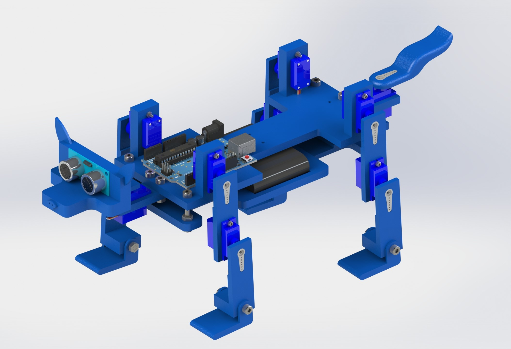
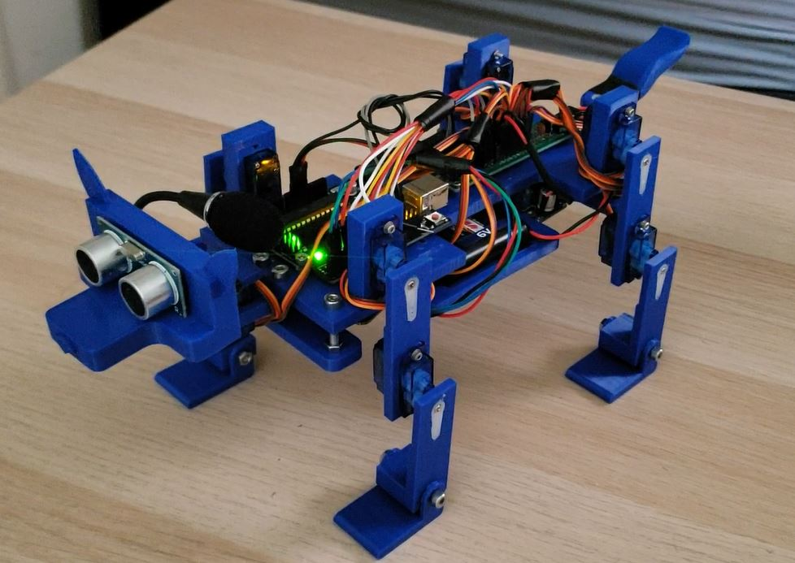

# [Duke: Voice Controlled Robot Dog](https://www.youtube.com/watch?v=mIvEY3RJ5Mg)

 

 
 

Robot dog controlled by Arduino. A personal solo project that I completed while recovering from a surgery.  
All parts were personally designed and 3D printed. Simple circuit board/design controlled by Arduino.  

The general components of the robot are listed below.  
- Voice recognition coded using Geeetech VR module controlled by an Arduino UNO
- Miuzei SG90s were used and and connected to a soldered circuit board consisiting of capacitors and Piezo buzzer
- Robot powered by 6V 2000mAh NiCAD batteries. Voltage booster used to power Arduino at 9V
- Parts were 3D printed entirely from Hatchbox Blue PLA and designed through SolidWorks
- Assembly done by M2, M3, and M4 nuts and bolts

**Controller code is very basic and so far only supports simple voice commands such as "sit" and "stretch".**  
Project is on hold for now as I wish to pursue other projects.  
List of todos:
- Implement computer vision with a Rpi
- Implement walking algorithm
- Add additional sensors for proper indoor navigation
